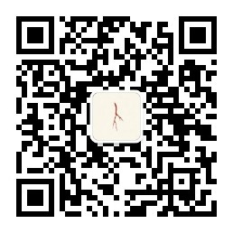

<div align="center">

# 让 AI 更懂你

**Growing an AI that knows you — not another prompt collection.**

AI 失忆、没人味、每次从零开始？
把 prompt 收藏夹，换成一套**越用越懂你**的系统。

`26 个 Skill` `3000+ 条记忆索引` `开源核心 · MIT`

</div>

---

## 你是不是也这样

重度用 AI——Claude Code / Cursor / ChatGPT 天天开，却始终：

| 痛点 | 你每天在付的代价 |
|---|---|
| **AI 失忆** | 昨天教过的东西，新开窗口全部清零——每天早上给 AI 重新上岗培训 |
| **没人味** | 产出一股机器腔，你的调性、你的读者、你的红线，它始终学不会 |
| **每次从零开始** | 收藏了几百条 prompt，真干活时还得从头介绍「我是谁、写给谁、要什么」 |

**prompt 是零件，系统是整车——零件每次重装，整车越开越顺。**

## 我每天在跑的系统：让 AI 懂你的三层工程

不教单次提问，搭一套越用越懂你的 AI 系统：

| 层 | 干什么 | 一句话比喻 |
|---|---|---|
| **① CLAUDE.md 路由** | AI 一进门就知道你是谁、写给谁、什么调性 | 门牌 + 说明书 |
| **② 记忆系统** | 规则、偏好、项目、外链沉淀为可调用记忆，跨会话不失忆 | 长期记忆，不是聊天记录 |
| **③ Skill / MCP / CLI 三件套** | 选题、生产、发布整条创作管线工程化 | 给 AI 装上手、眼、腿 |

**开源核心已就位** → [metax-knowledge-base](https://github.com/bigiod/metax-knowledge-base)

四目录最小可用原型 + 单文件 CLI 引擎，零依赖、零 API key，
Claude Code / Codex / Gemini CLI 等多客户端通用，MIT 协议拿走就能跑：

```text
样本知识库/
├── AGENTS.md                        # 指令真身：装载 + 纪律 + 导航
├── 品牌/   业务/   工具/   记忆/      # 四角色目录
└── 工具/metax-knowledge-base-cli/    # 引擎：health / add / list / promote
```

## 为什么信它

我不教我没用过的——这套系统我每天在跑，是活证据。

| 证明 | 口径 |
|---|---|
| **19 项证书 · 11 家机构颁发** | AWS · Microsoft · NVIDIA · 华为 · Yale · 联合国 ITCILO …（[LinkedIn 复核](https://www.linkedin.com/in/aizx/)） |
| 一人一月，零代码上线小程序 | 2024 年独立完成『卜我』开发、测试、部署、运营 |
| 30+ 个系统化工作流 | 从 n8n 到 Claude Code，工程化能力一层层长出来 |
| 小红书 1.1 万关注 | AI 主题日更起号，粉赞比 1:5 |

## 它不适合谁（说清楚，省得浪费你时间）

- 想找「一键躺赚」神奇 prompt 的——这里只有每天进步一点点的工程
- 只想收藏、不想动手搭的——系统长在实践里，不长在收藏夹里

**但如果你是把 AI 当真生产力、想让它长成懂你样子的人，从这里开始：**

## 让 AI 开始懂你

<div align="center">

### 关注公众号『卜我』

**我亲测实践，让 AI 懂你。**

三层工程拆解、Skill 配方、踩坑复盘——这套系统怎么一天天长出来，全部第一时间发在这里。



微信号：`hibuwo`（扫上方二维码，或微信搜索关注）

</div>

---

**其他入口**：[zhangxuan.ai](https://zhangxuan.ai) · [小红书](https://www.xiaohongshu.com/user/profile/59f87643db2e602e550c9714) · [Bilibili](https://space.bilibili.com/320520702) · [X @MetaversePlus](https://x.com/MetaversePlus) · [LinkedIn](https://www.linkedin.com/in/aizx/) ｜ 商务：tybcc@126.com

> 学知识、致良知、开世界——普通人的持续微迭代，终将在数字世界兑换出真实价值。
